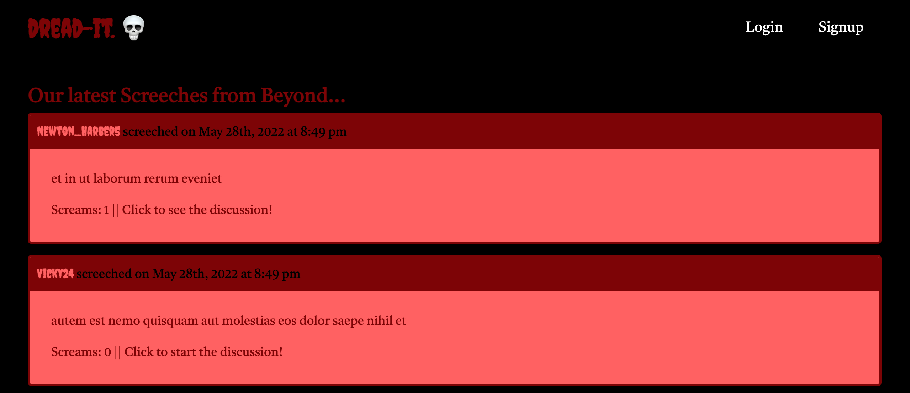

## Description
Dreadit is a social media app where horror, thriller, and chiller enthusiasts users can share and react to the latest spooky discoveries, adding other users to their friend (aka Ghoul) list. 

This is a full-stack MERN app using a GraphQL API and Apollo Server for CRUD database interaction. The front-end was developed with React and the back-end was developed with MongoDB, Mongoose, Express and Node.js. GraphQL queries and mutations were used for CRUD functionality.

## Table of Contents
- [Technology Used](#technology-used)
- [Screenshots](#screenshots)
- [See It In Action](#see-it-in-action)
- [License](#license)

## Technology Used
  
  
  
  
    
   
  
  
   
  
  

## Screenshots

## See It In Action

#### License

`dreadit` is published under the **CC0_1.0_Universal** license.

> The Creative Commons CC0 Public Domain Dedication waives copyright interest in a work you've created and dedicates it to the world-wide public domain. Use CC0 to opt out of copyright entirely and ensure your work has the widest reach. As with the Unlicense and typical software licenses, CC0 disclaims warranties. CC0 is very similar to the Unlicense.